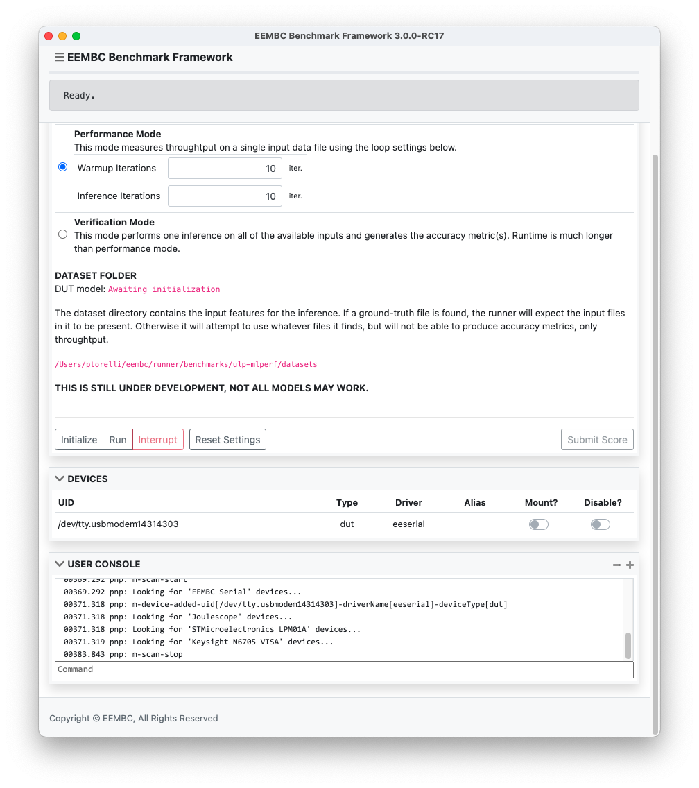

# Introduction

This is an alpha release of the benchmark runner for ULPMark&trade;-ML and tinyMLperf. It is still missing several features as we are currently debugging and developing.

The goal is to facilitate bringup of the firmware, not collect official scores. This software is provided solely for the purpose of cross-development between EEMBC and MLCommons's tinyMLperf. This repository will be removed and replaced with an official release once development is done.

What it does:

1. Detects compatible USB devices (115200 baud, 8N1, responds to firmware queries defined by the [EEMBC/tinyML firmware](https://github.com/eembc/testharness-ulpmark-ml)).

2. Connects to (mounts) the hardware, initializes it, and provides *performance* or *validation* testing mock-up runs.

3. Searches a directory for available stimulus files based on the DUT model query.

4. In performance mode, it runs N warmup and M measurement iterations on the first binary file located in the test input directory. In validation mode, it runs one iteration of every file in the test input directory.

What it does NOT do:

1. Compute AUC/ROC. We haven't decided on input and ground-truth file formats yet.

2. Allow score submission (this has not been discussed in either working group yet)

3. Perform energy measurements.

# Usage

This is a very brief user guide for booting the framework and testing connectivity.

There are three OS release: Mac Big Sur / Catalina, Ubuntu 18.04 (probably works on 20.04), and Win10. The macOS version is provided as a \*.app file. Linux and Windows are provided as zip-files.

Open the application by double-clicking the icon in macOS, running `EEMBC Benchmark Framework.exe` in windows, or `benchmark-framework` in Linux. if everything booted properly this window appears:

The first line in the User Console indicates the temporary directory and root used by the framework. See below for notes on customizing this.

Take note of the directory (in red) in the center of the screen. This is a work directory that has been created. Unzip the `ulp-mlperf.zip` file into that directory to create the following tree structure. Note these files are bogus random binary data and are provided for testing `kws01`. Since the framework determines where to look for input files based on the model response from the DUT, you can rename this to match whatever NN you are targeting.

Plug in the USB device connected to the device under test (DUT). The device should appear under the device console. Some operating systems take longer than others to scan USB, so this could take anywhere from a few hundred milliseconds to a few seconds.

If you see warnings about missing VISA drivers, ignore them. (The code supports VISA test hardware, but it is irrelevant for performance testing.)

Click "initialize" under the benchmark section and the runner will mount the device and handshake. At this point, you can issue commands to the DUT by typing `dut <command>` in the User Console input line. Also note that the `Model: kws01` has been automatically populated. Handshaking with the DUT causes the DUT to print a special query message alerting the runner of the correct model inputs to use.

At this point, clicking `run` will download each of the binary files to the DUT using the `db` commands (as stated above, depending on the mode) and collect a timing score. In this example `infer` does nothing but execute a small time-killing loop. The difference between the two `m-lap-us` statements is the # of microseconds elapsed. The value will depend on the resolution of the timer implemented on your DUT.

If you made it this far, you can now develop & communicate with your firmware. Please contact `peter.torelli@eembc.org` with bugs or questions, or simply file an issue on this repo.

# Custom Configuration

First, identify your $HOME directory. On Linux and macOS this is `$HOME`, on Win10 it is `%USERPROFILE%`. Create a file in this folder called `.eembc.json`:

~~~
% cat $HOME/.eembc.json 
{
    "root": "/Users/ptorelli/nobackup",
}
~~~

Change `root` to wherever you want the runner to generate the `eembc/runner/{sessions,temp,benchmarks}` directories. It will create these the next time the framework starts.

# Copyright License

This software is the copyright of EEMBC, and is currently released under Apache 2.0.
